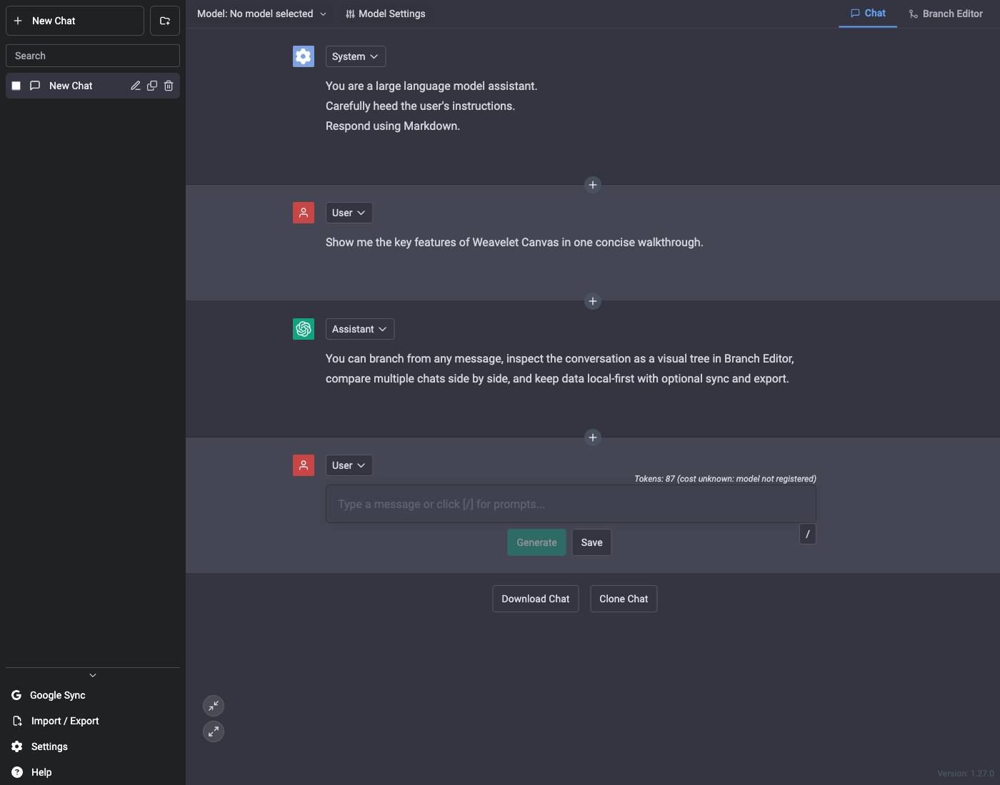
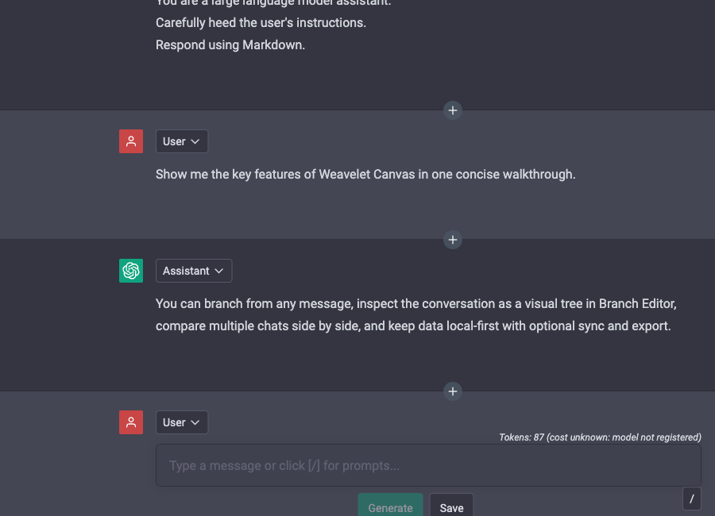
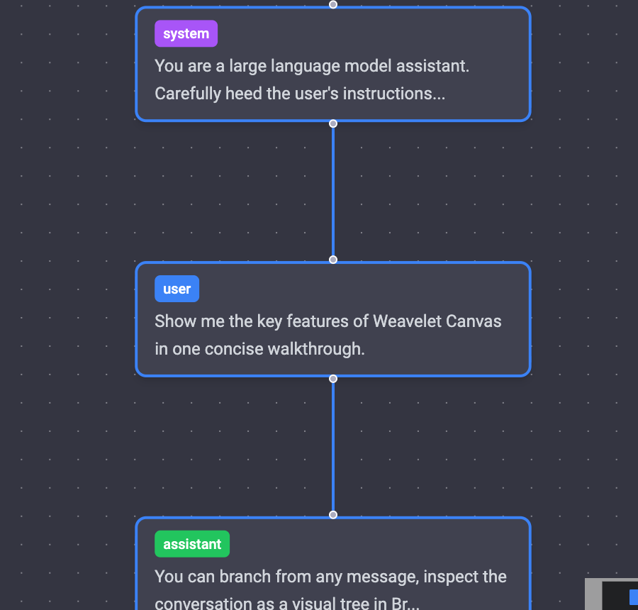

# Weavelet Canvas

[](./LICENSE)
[](https://github.com/shuna/weavelet-canvas/actions/workflows/deploy.yml)
[](https://pages.cloudflare.com/)
[](https://react.dev/)
[](https://www.typescriptlang.org/)

## English

Weavelet Canvas is a chat workspace forked from BetterChatGPT and BetterChatGPT-PLUS, designed for editing conversations and managing branches while switching between multiple AI providers.

Alongside multi-conversation management, model switching, message editing, saving, and synchronization, it supports OpenRouter and other OpenAI-compatible AI providers, and includes a visual branch editor for restructuring conversations.

### Feature Highlights

The screenshots below use an English sample conversation so the main workflows are easy to scan at a glance.

#### Workspace Overview



- Chat and Branch Editor are available side by side in the same workspace
- Messages can be edited in the middle of a conversation and saved directly into the flow
- Local-first management is combined with optional sync, export, and model/provider controls
- OpenRouter, OpenAI, DeepSeek, Mistral, Groq, Together AI, Perplexity, xAI, Cohere, and Fireworks can be configured from AI Provider Settings

#### Focused Screens

**Mid-conversation editing**



- Save edits directly into the conversation without rebuilding the whole chat from scratch
- Regenerate controls and per-message actions stay attached to the edited node

**Visual branch inspection**



- Branch Editor turns the active conversation path into a readable node graph
- This view is useful for checking branch structure before switching chats or comparing paths

### Main Changes Merged into This Fork

Below is a summary organized from the pull requests that have been merged into this fork so far.

#### Major Changes

- Added a Visual Branch Editor for handling conversation branches visually
- Added collapsible message bubbles and improved the related interaction UI
- Introduced transparent `lz-string` compression to improve localStorage / Google Drive persistence efficiency
- Introduced ContentStore-based deduplication for message content to reduce storage usage

#### Minor Changes

- Implemented performance improvements around rendering, editing, and chat switching
- Added PWA support
- Added an ON/OFF toggle for streaming responses to model settings
- Added Service Worker-based background stream recovery
- Added an action to regenerate only the next response after edits made in the middle of a conversation and made it the default flow
- Added UI and related logic to regenerate from every conversation bubble
- Added a toggle for ShareGPT button visibility
- Cleaned up the visibility of About / Author related menus
- Improved feedback when saving provider API keys
- Improved silent refresh behavior for Google Drive
- Improved token cost display with provider-aware pricing support
- Added inline model switching in the chat header
- Consolidated model option display into a single button
- Reworked the toolbar row layout to unify model selection and view controls
- Improved the placement and consistency of branch switching actions and message actions
- Preserved scroll position and the selected branch when switching views
- Improved the collapse UI and responsive tab bar
- Reorganized the API settings screen and consolidated it into AI Provider settings
- Added a branch-only button to separate branching behavior
- Changed chat duplication so the duplicated chat is selected immediately
- Improved iOS status-bar tap-to-scroll-to-top behavior
- Added missing Japanese locale files

#### Other Bug Fixes

- Fixed multibyte character decoding issues during streaming
- Rewrote the SSE parser to fix corrupted streaming responses
- Fixed the inconsistency where favorite model definitions were missing `contextLength`
- Fixed an issue where the max token slider was incorrectly clamped to 100
- Fixed JSON import so it can handle unrecognized model IDs
- Fixed drag conflicts while renaming chats
- Fixed branch synchronization issues during message edit and submit flows
- Fixed branch tree synchronization issues when deleting messages
- Fixed the add message button being partially hidden by the next message
- Fixed streaming support detection and Firefox-specific update handling
- Prevented redundant persisted settings updates
- Reduced the cost of persisting collapsed state
- Reduced unnecessary re-renders
- Refactored shared regenerate logic to improve the stability of related actions

### Development

#### Run Locally

```bash
yarn
yarn dev
```

or

```bash
npm install
npm run dev
```

#### Build

```bash
yarn build
```

#### Updating the wllama Worker Code

`src/vendor/wllama/index.js` is a pre-built bundle that includes project-specific
extensions (e.g. `loadModelFromOpfs`) not present in the upstream fork source.
**Do not replace this file by running `npm run build:tsup` in `.wllama-fork`**
— that would rebuild from the upstream source and silently drop the custom API.

To patch only the embedded worker code (`llama-cpp.js`):

1. Edit `.wllama-fork/src/workers-code/llama-cpp.js`
2. Regenerate `generated.ts`:
   ```bash
   cd .wllama-fork && npm run build:worker
   ```
3. Surgically replace the `LLAMA_CPP_WORKER_CODE` constant in the existing
   `src/vendor/wllama/index.js` (Python one-liner):
   ```bash
   python3 - <<'PY'
   import re, json
   with open('.wllama-fork/src/workers-code/llama-cpp.js') as f:
       new_code = json.dumps(f.read())
   with open('src/vendor/wllama/index.js') as f:
       bundle = f.read()
   bundle = re.sub(
       r'(var LLAMA_CPP_WORKER_CODE\s*=\s*)"(?:[^"\\]|\\.)*"',
       r'\g<1>' + new_code,
       bundle,
   )
   with open('src/vendor/wllama/index.js', 'w') as f:
       f.write(bundle)
   print('Done')
   PY
   ```

To rebuild the Emscripten WASM glue or the entire wllama library, see
[`vendor/wllama/WASM-BUILD.md`](./vendor/wllama/WASM-BUILD.md).

#### Google Drive Sync Setup

Google Drive sync requires your own Google OAuth Web client ID via `VITE_GOOGLE_CLIENT_ID`.

- The shared/demo deployment may show `403: access_denied` if the OAuth app is still in Google's Testing state and your Google account is not registered as a test user.
- If you deploy this fork yourself, create your own OAuth client in Google Cloud, add your site URL to Authorized JavaScript origins, and configure the OAuth consent screen for the Google Drive scope used by this app.
- This app requests `https://www.googleapis.com/auth/drive.file` for Drive sync.

### Acknowledgements

Deep thanks to the authors and contributors of [BetterChatGPT](https://github.com/ztjhz/BetterChatGPT), which provided the starting point for this project.  
This fork was able to accumulate its improvements because of the excellent foundation they created for extending a local-first conversation workspace.

We also sincerely thank the authors and contributors of [BetterChatGPT-PLUS](https://github.com/animalnots/BetterChatGPT-PLUS), who added many practical extensions.  
This repository inherits those improvements while continuing to improve operations, refine the UI, strengthen branch-editing features, and improve performance.

---

## 日本語

Weavelet Canvas は、[BetterChatGPT](https://github.com/ztjhz/BetterChatGPT) と [BetterChatGPT-PLUS](https://github.com/animalnots/BetterChatGPT-PLUS) からフォークした、複数のAIプロバイダを使い分けながら、会話の編集や分岐管理ができるチャット環境です。

複数会話の管理、モデル切り替え、メッセージ編集、保存・同期に加えて、OpenAI 互換 API に対応した OpenRouter ほか複数の AI プロバイダ対応と、会話を再構成するための視覚的分岐エディタを備えています。

### 主要機能

#### ワークスペース全体


- 同じワークスペース内でチャットと分岐エディタを切り替えられます
- 会話の途中メッセージを編集し、そのまま保存・再生成できます
- OpenRouter、OpenAI、DeepSeek、Mistral、Groq、Together AI、Perplexity、xAI、Cohere、Fireworks などの AI プロバイダを設定できます

**メッセージ編集と再生成操作**


- 会話内のメッセージを自由に編集・挿入・削除できます
- メッセージ単位で保存や再生成を進められます
- メッセージごとの編集操作を操作しやすいホバーメニューにまとめています

**見やすい分岐エディタ**


- 分岐エディタでは会話の流れをノードとして視覚的に編集できます

### このフォークで加えた主な変更

以下は、本フォークで加えた変更の要約です。

#### 大きな変更

- 会話の分岐を視覚的に扱える視覚的分岐エディタを追加
- メッセージバブルの折りたたみ機能を追加し、操作 UI も改善
- `lz-string` による透過圧縮を導入、localStorage / Google Drive 保存を効率化
- ContentStore によるメッセージ内容の重複排除を導入し、保存容量を削減

#### 小さな変更

- 表示・編集・会話切替周辺のパフォーマンスを改善
- PWA 対応を追加
- ストリーミング応答の ON/OFF 切り替えをモデル設定に追加
- Service Worker を利用したバックグラウンドのストリーム復旧機能を追加
- 編集途中の文脈に対して「次だけ再生成」できる操作を追加しデフォルト化
- すべての会話バブルから再生成できる UI と関連ロジックを追加
- ShareGPT ボタンの表示切替を追加
- About / Author 系メニューの表示を整理
- Provider API Key 保存時のフィードバックを改善
- Google Drive のサイレントリフレッシュ挙動を改善
- プロバイダごとの料金表示に対応し、トークンコスト表示を改善
- チャットヘッダーにモデルのインライン切り替えを追加
- モデルオプション表示を 1 つのボタンに整理
- ツールバーの行構成を見直し、モデル選択とビュー操作を統合
- ブランチ切り替え操作とメッセージアクションの位置関係を改善
- ビュー切り替え時のスクロール位置と選択中ブランチを保持
- 折りたたみ UI とレスポンシブなタブバーを改善
- API 設定画面を整理し、AI Provider 設定へ統合
- branch-only ボタンを追加して分岐操作を分離
- 複製したチャットを複製直後に自動選択するよう変更
- iOS でステータスバータップによる最上部スクロールを改善
- 日本語ロケール不足分を追加

#### その他バグ修正

- ストリーミング時のマルチバイト文字デコード不具合を修正
- SSE パーサを書き直し、ストリーミング応答が壊れる問題を修正
- お気に入りモデル定義に `contextLength` が欠ける不整合を修正
- max token スライダーが不正に 100 へ丸め込まれる問題を修正
- JSON インポート時に未知のモデル ID を含んでいても取り込めるよう修正
- チャット名変更中にドラッグ操作が競合する問題を修正
- メッセージ編集・送信時の branch 同期不整合を修正
- メッセージ削除時の branch tree 同期不整合を修正
- add message ボタンが次のメッセージに隠れる問題を修正
- ストリーミング対応判定と Firefox 向けの更新処理を修正
- 設定保存時の不要な永続化更新を抑制
- 折りたたみ状態保存まわりのコストを削減
- 不要な再レンダリングを抑制
- 再生成処理の共通ロジックを整理し、関連操作の安定性を向上

### 開発

#### ローカル起動

```bash
yarn
yarn dev
```

または

```bash
npm install
npm run dev
```

#### ビルド

```bash
yarn build
```

#### wllama ワーカーコードの更新

`src/vendor/wllama/index.js` はプロジェクト独自の拡張（`loadModelFromOpfs` 等）を含む
事前ビルド済みバンドルです。アップストリームフォーク側で `npm run build:tsup` を実行して
このファイルを上書きすると、カスタム API が失われます。

`llama-cpp.js` のみを更新する場合は以下の手順を使用してください:

1. `.wllama-fork/src/workers-code/llama-cpp.js` を編集
2. `generated.ts` を再生成:
   ```bash
   cd .wllama-fork && npm run build:worker
   ```
3. `src/vendor/wllama/index.js` 内の `LLAMA_CPP_WORKER_CODE` 定数だけを差し替え（Python）:
   ```bash
   python3 - <<'PY'
   import re, json
   with open('.wllama-fork/src/workers-code/llama-cpp.js') as f:
       new_code = json.dumps(f.read())
   with open('src/vendor/wllama/index.js') as f:
       bundle = f.read()
   bundle = re.sub(
       r'(var LLAMA_CPP_WORKER_CODE\s*=\s*)"(?:[^"\\]|\\.)*"',
       r'\g<1>' + new_code,
       bundle,
   )
   with open('src/vendor/wllama/index.js', 'w') as f:
       f.write(bundle)
   print('Done')
   PY
   ```

Emscripten WASM グルーや wllama ライブラリ全体の再ビルドは
[`vendor/wllama/WASM-BUILD.md`](./vendor/wllama/WASM-BUILD.md) を参照してください。

### 謝辞

このプロジェクトの出発点となった [BetterChatGPT](https://github.com/ztjhz/BetterChatGPT) の作者・コントリビューターの皆様に深く感謝します。  
ローカル主導の会話ワークスペースを拡張できる優れた土台があったからこそ、本フォークでの改善を積み重ねることができました。

また、数多くの実用的な拡張を加えた [BetterChatGPT-PLUS](https://github.com/animalnots/BetterChatGPT-PLUS) の作者・コントリビューターの皆様にも感謝します。
本リポジトリはその成果を受け継ぎながら、さらに運用上の改善、UI 調整、分岐編集まわりの機能強化、パフォーマンス改善を継続している派生プロジェクトです。

---

### Known Technical Debt

#### JSON.parse/stringify による手動ディープクローン

メニュー周辺では `src/components/Menu/ChatFolder.tsx`、`ChatHistoryList.tsx`、`NewFolder.tsx` で `JSON.parse(JSON.stringify(...))` を使用している。`ChatHistory.tsx` は既に `src/utils/chatShallowClone.ts` に移行済みだが、folders 更新用の浅い不変更新ヘルパーがまだ存在しない。

また、`src/components/ImportExportChat/importService.ts` と `src/utils/chatExport.ts` にも `JSON.parse/stringify` ベースのクローン処理が残っている。現状は動作しているが、`undefined` や非 JSON 値を落とす前提のため、将来的には `structuredClone` か用途別ユーティリティへの置き換え余地がある。

#### モーダルの状態管理パターン

14 コンポーネントで `useState<boolean>(false)` + `setIsModalOpen` の同一パターンが繰り返されている。`useModal()` カスタムフックに抽出可能。

#### 直接ミューテーションを含む更新処理

`src/components/ImportExportChat/importService.ts` の `shiftAndMergeFolders()` では、`useStore.getState().folders` 内の `folder.order` を直接更新してから `setFolders()` している。現状の Zustand 運用では大きな不具合は出ていないが、参照共有前提の最適化や将来のリファクタで副作用源になりやすい。

#### レガシーコード

`src/components/LegacyCustomModelsBanner.tsx` が `App.tsx` でまだレンダリングされている。これは旧 `customModels` を v13 migration で `_legacyCustomModels` に退避し、手動再登録を促す導線になっている。

移行期間が十分に終わっていれば削除候補だが、その場合は UI だけでなく `provider-slice.ts` の `_legacyCustomModels` / `clearLegacyCustomModels()`、`migrate.ts` の v13 migration、`persistence.ts` の保存対象も合わせて整理する必要がある。
