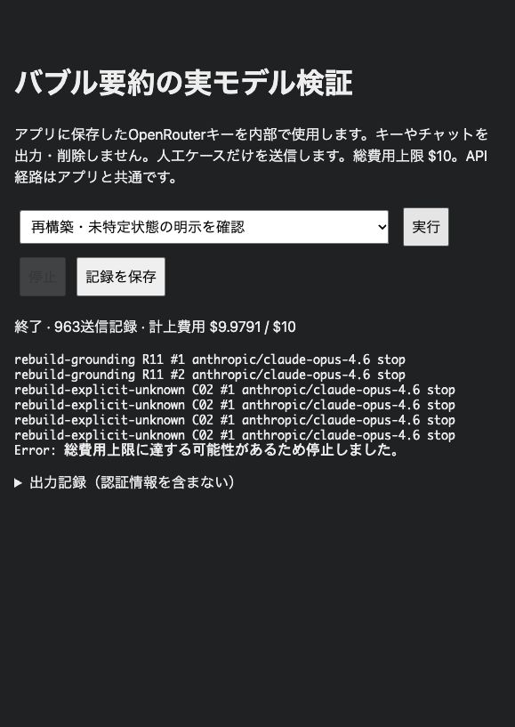

# AI投入用圧縮プロンプトの再構築

2026-10-06。予算リセット後の上限10米ドルで、OpenRouterのAnthropic Opus 4.6を再検証した。**963回、実費9.97914米ドル**。原文・現行・候補を使った後続応答を比較した。長い会話の一部で状態保持と入力削減を確認したが、未特定の対象を後続モデルが補う失敗は解消していない。全般的な品質向上や原文との等価性は断定しない。

## 再構築の根拠

[先行研究調査](../../reports/prompt-compression-literature-2026-10-06.md)を前提に、次回生成に必要な意味と文体を残す処理として設計した。学習済み抽出器や内部状態の圧縮による削減率を、編集可能なテキストの単発プロンプトで再現できるとは扱わない。Astra中による[過去結果再評価](old-result-review.md)で、原文にも発生する形式違反と、圧縮により増える違反を区別した。

[切り分け実験](ablation-review.md)では、旧候補プロンプトが台本化を減らす一方、旧案内文の「文脈を報告しない」という禁止が、要求されたログ説明の先送りと関連した。採用と実施も混同された。compact用規則を直接の依頼、話者と採用状態、予定・完了・未実施、意味を決める値と例、文体、重複除去に整理した。置換案内文では圧縮の整理用書式と元の応答指定を区別し、採用や予定を実施と扱わないようにした。

v1では予定の述語が対象範囲だけに縮められ、採用された台詞の地の文も失われた。v2は予定の述語を対象と一緒に残し、台詞と地の文を一続きで保持する。v3は実行場所・範囲・手順の順序、未特定条件を維持する指示を明示した。v5は申告者と未提示の原因領域を、v6は原因領域の例示も禁止する規則を加えた。共通・単独・連続の規則、role/content入力、単発生成、原文保持、既存の削減判定は維持し、内容別の事前分類や追加の生成段階は導入しない。

## 条件と反復

モデルは `anthropic/claude-opus-4.6`、返却プロバイダは全件 `Claude Platform on AWS`。temperature=1、top_p=1、frequency/presence penalty=0、reasoning_effort=none、force_reasoning=true、response cache=off。API経路はアプリ共通の `getChatCompletion`、auxiliary=true。人工ケースだけを送信した。APIキーと実際のユーザー会話は記録に含めない。

通常はmax_tokens=2048。noexamplesは256。groundingはC02が256、物語R11が768。最終explicit-unknownは128で、打ち切り出力は合格にしない方針とした。**全963応答はfinish_reason=stop**。異なる出力上限の結果は同じ設定として合算評価しない。

開発と未使用ケースは原則3圧縮反復、各圧縮を1〜2問の後続生成で確認。既存36件の回帰は2圧縮反復。修正診断は2反復を予定したが予算予約で停止し、repairのT06は1反復、explicit-unknownは1反復のみ。同じ圧縮からの複数回答を独立した圧縮成功とは数えない。担当者は候補名を知るため盲検ではない。最終版の全36件回帰と新しい未使用ケース検証までは予算内で完了していない。

[方法](method.md)、[計画](plan.md)、[モデル情報](model-metadata.json)、[使用量集計](budget-summary.json)を保存した。全API使用量は入力1,115,078、出力176,150、合計1,291,228 tokens。料金は返却usage.costの合計。通常はUTF-8要求サイズと出力上限で費用を予約し、最終診断だけ同一プロンプト接頭部の実測入力量＋追記のバイト数＋256tokensの余裕で予約した。後者は経験的な保守推計で厳密なトークン上限ではない。新しい予約が残額を超える前に停止し、追加の課金は行っていない。

| フェーズ | 送信回数 | 実費 USD | 記録・判定 |
| --- | ---: | ---: | --- |
| プロンプトと案内文の切り分け | 129 | 0.957860 | [結果](ablation-results.json) / [判定](ablation-review.md) |
| 開発 v1 | 132 | 1.223865 | [結果](development-results.json) / [判定](development-review.md) |
| 開発 v2 | 132 | 1.251250 | [結果](development-v2-results.json) / [判定](development-v2-review.md) |
| 未使用6件 | 144 | 1.440950 | [結果](holdout-results.json) / [判定](holdout-review.md) |
| 案内文 W3 | 66 | 0.375030 | [結果](wrapper-results.json) / [判定](wrapper-review.md) |
| 長文の未使用3件 | 72 | 1.120415 | [結果](final-holdout-results.json) / [判定](final-holdout-review.md) |
| 規則を入力の後に置く v4 | 45 | 0.655650 | [結果](layout-results.json) / [判定](layout-review.md) |
| 前置規則 v3の未使用2件 | 48 | 0.526450 | [結果](layout-holdout-results.json) / [判定](layout-holdout-review.md) |
| 既存36件の意味回帰 v3 | 144 | 1.994800 | [結果](regression-results.json) / [判定](regression-review.md) |
| 帰属・未提示前提の修正 v5 | 35 | 0.363095 | [結果](repair-results.json) / [判定](repair-review.md) |
| 未提示の例示禁止 v6 | 8 | 0.036640 | [結果](noexamples-results.json) / [判定](noexamples-review.md) |
| 案内文 W4 | 4 | 0.013220 | [結果](grounding-results.json) / [判定](grounding-review.md) |
| 対象未特定の明記 v7 | 4 | 0.019915 | [結果](explicit-unknown-results.json) / [判定](explicit-unknown-review.md) |
| 合計 | 963 | 9.979140 | |

JSONには各要求のモデル設定・入力・出力・使用量・応答IDを保存し、同名review JSON/Markdownで判定理由を示す。候補の固定スナップショットと入力ケースも保存した。各結果の成功回数を単一の総合合格率へまとめない。

## 観測した改善と劣化

- **予定・状態**：未使用R10では部分採用、40件、検索条件、ローカルテスト画面、次回予定・未実施を候補3/3圧縮で保持した。原文にも形式違反があり、二文指定の達成は現行・候補とも6/6、原文3/6。形式の成功だけを差として扱わない。
- **物語の現在状態**：未使用R11ではチケットをKanaが持つ事実を現行が3/3圧縮で落とし、後続5/6でToruへ誤移転した。候補は3/3圧縮で保持し、後続6/6でKanaのまま維持した。二段落の地の文は候補3/6、現行3/6、原文2/6で、改善を確認できなかった。
- **台詞と文体**：T10の台本ラベルは現行6/6、候補0/6。ただし敬体は候補2/6、現行6/6、原文3/6で候補が劣る。T14のラベル・敬体は候補3/3で保持。文体全般の保持を達成したとは扱わない。W3だけの変更でT10敬体やR02の地の文二文指定は改善せず、W3の優越は未確認。
- **申告の帰属**：回帰C06でv3がユーザー申告の出所を2/2圧縮で落とした。v5の局所修正では圧縮・後続とも2/2で申告者を保持した。
- **未提示の対象**：回帰C02でv3は2/2、現行は0/2で証明書・期限の前提を加えた。v5は1/2で対象の具体化や例示が残った。v6は2/2で圧縮文から領域を除いたが、対象を問う後続応答は2/2でキャッシュと回答し、原文は2/2で未特定と回答した。W4の推測禁止でも2/2の誤認が残った。v7は未特定を明記した圧縮に対して後続が証明書と回答した（1/1、128上限でもstop）。**この失敗は未解決**。見栄えのよい圧縮文だけで合格にしない。
- **その他の回帰**：C03の「今回」の範囲は現行・候補とも2/2で欠落。S16の本文内Assistantラベルは候補1/2で引用の帰属を誤解。S09の出所欠落、R04の実行場所、R06の未特定条件維持にも不安定さが残った。T06の結果全体nullは全条件で不安定で、候補が説明をコード外へ加えた例もある。このv5の例は推定原文263対置換262で自動採用の条件に達しており、非削減ガードだけでは防げない。v6で修正を確認していない。重要な意味違反を形式の改善と相殺しない。

## 削減量と自動採用

同じ質問を付けた**実APIの入力tokens**では、T13が約81%、T14が約79%、未使用R10が約49〜68%、R11が約35〜44%減った。旧候補の反復や不要な候補を含む長文での結果であり、どの長文にも適用できる削減率ではない。これらは主にv2/v3の比較で、v6の全条件で再確認した数値ではない。要約生成にかかる費用もあるため、入力削減率をそのまま総費用削減率にはしない。

アプリの推定tokensはAnthropicの実測値とは異なる。runnerでは起動時の文字数/2と準備後のcl100k_baseが混在したため、原記録を保存したうえで[再集計](token-recount.json)した（[再現スクリプト](recount.mjs)）。以前の「すべて原文へ戻る」という評価は訂正した。準備済み推計ではR07も約8〜14%削減、R10/R11は全反復で圧縮を自動採用する判定になる。

C02の短い原文は推定92tokens、候補置換は111〜184tokensで、**既存の自動削減判定では原文を表示・送信する**。これは自動経路の保護であり、圧縮の品質改善ではない。保存した圧縮を明示選択すれば後続の誤認が生じる可能性は残る。原文・要約・圧縮の編集と切り替え、既存のモデル・パラメータ設定は維持する。

## 最終判断と確認

[採用監査](adoption-review.md)に基づき、v6のcompact規則とW3の置換案内文を局所改善として採用する。意味等価性は保証しない。利用者が圧縮生成を選ぶと、削減できる場合は表示・送信を自動で圧縮へ切り替える既存動作を維持する。内容を人が確認する工程は強制されない。入力の後へ全規則を移すv4、案内文W4、対象未特定を後置するv7は改善が確認できず採用しない。`candidate-bubbleSummaryPrompt.ts`は採用したv6、`candidate3-bubbleSummarySubmitMessage.ts`は採用したW3の固定記録。共通規則・読みやすい要約のプロンプトはbaselineと同一。

少数反復・候補名既知の評価であり、統計的優位、他モデル・パラメータへの一般化、あらゆる後続質問への意味保持は未確認。原文にも失敗する指定と、圧縮で新たに増える意味違反を区別した。原文と異なる創作の語句だけでは失格としないが、未提示前提・現在状態・有効な制約の変更は残る問題として扱う。最終版の全回帰・新しい未使用ケース・文体不安定性の解消が次の検証範囲となる。

関連5ファイルの64テスト、アプリと手動runnerの型チェック、本番ビルド、git diff --checkは成功。ビルドには既存のBrowserslist更新・大きいchunkの警告がある。共通・単独・連続の規則と要求JSON生成がbaselineから変わっていないことも比較した。これらのテストは生成品質の保証ではない。

